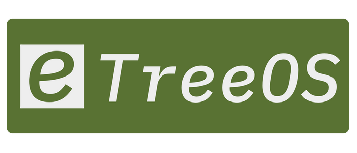
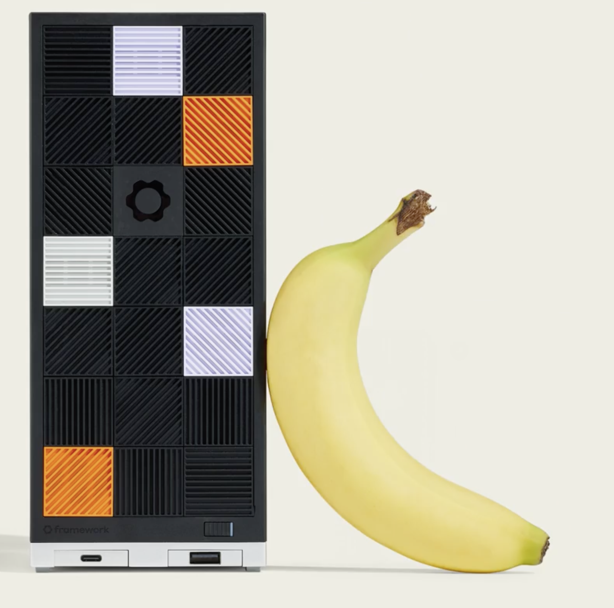

<p align="left">
  
</p>

[](https://github.com/stefanmunz/treeos/actions)

## What is TreeOS?

TreeOS brings the **App Store experience to your server**, just in time for the age of AI powered mini apps and skills! Even better, TreeOS frees you from depending on pricey cloud solutions, guiding you to easily run your own node on your site. TreeOS is optimized to run with tailscale, the next-gen seamless VPN, so you don't have to expose your node to the Internet. Try it out frictionless in the cloud and move to your own hardware when you're ready. Digital sovereignty from the bottom up!

Browse a curated catalog of apps, click to install, and watch your apps deploy automatically. Equally browse a list of curated open source LLM models, and one-click install your favourite ones. All on your own hardware! Watch the video below for more details.

**Key Capabilities:**

- **📱 App Store Simplicity** – Browse, install, and manage server applications with the same ease as on your phone. One click to deploy service stacks with the power of Docker Compose.
- **🧠 Model-Native Platform** – LLM models are first-class citizens. Pull curated models, and plug them straight into your apps.
- **🤖 Built for AI & Agentic Coding** – Designed from the ground up to work with AI assistants. Install routines, slash commands, and structured APIs let agents manage your infrastructure autonomously.
- **🛠️ Built for Builders** – Bring your own code, keep data on your hardware, and iterate quickly with full control over your own stack.

## Recommended Hardware

TreeOS is optimized for the **AMD Ryzen™ AI Max+ 395** with 128GB of RAM. This powerful APU allows local inference and application hosting to share the same machine gracefully, eliminating the need for separate GPU servers.

Our preferred hardware vendor is [Framework](https://frame.work/desktop) with their Desktop machine, starting at **$1,999 USD** (€2,329 in Germany). The Framework Desktop combines:

- **Upgradeable & Repairable Design** – Future-proof your investment with modular components
- **128GB Unified Memory** – Share memory between CPU and GPU for efficient AI workloads. Up to 96 GB assignable to the GPU means you can run GPT OSS 120B easily, for example.
- **AMD Ryzen AI Max+ 395** – Powerful APU with integrated RDNA 3.5 graphics
- **Perfect for Home Labs** – Quiet, compact, and energy-efficient, with a high WAF factor!

This is the perfect machine for a team or a household to become independent from cloud providers.

<div align="center">
  <a href="https://frame.work/desktop">
    
  </a>
  <p><a href="https://frame.work/desktop">Framework Desktop</a></p>
</div>

## Architecture

TreeOS is architected from the ground up to make use of agentic assistants. This is our stack for fast and iterative agentic software development:

- **Backend**: Go, bundling the whole app into one big binary for painless deploys
- **Frontend**: HTML, HTMX & Plain Javascript for dynamic UI, keeping it deliberately simple here
- **Database**: SQLite for metadata storage
- **Container Management**: Docker and Docker Compose
- **Connectivity**: : Leveraging Tailscale and MagicDNS to create beautiful HTTPS domains for your apps with no headaches
- **Platform Support**: Works on Linux and macOS, in the cloud and on your hardware on site. Optimized for Ubuntu 24.04 LTS.

## Features

- **Web-based Container Management**: Manage Docker containers through a clean web interface
- **Real-time Operation Logging**: View detailed logs of all container operations in real-time
- **Application Templates**: Pre-configured templates for popular applications (Ollama, OpenWebUI, etc.)
- **Model Management**: Install and manage AI models (Ollama integration, vllm coming up)
- **Dynamic UI Updates**: Real-time status updates using HTMX without page refreshes
- **Self-contained Binary**: Single executable with all assets embedded
- **Multi-architecture Support**: Runs on Linux (AMD64) and macOS (ARM64)
- **System Monitoring Dashboard**: Real-time system metrics with historical sparklines (CPU, Memory, Disk, Network)
- **Security Validation**: Built-in checks for container security (mounts, capabilities, privilege levels)
- **Tailscale Integration**: Automatic domain configuration for exposed applications

## Roadmap

### Developer Preview Status

TreeOS is currently in **Developer Preview**. While it is stable enough to run in production here in the last months, we cannot guarantee database compatibility between developer preview versions. Backwards compatibility will only be maintained starting with version 1.0.

### Current Release

**0.1 - Works For Us**

- Optimized for fulfilling our demands in production
- learned a lot about agentic coding and the demands it poses on the architecture

### Upcoming Releases

**0.2 - Works For Agents**

- Rebuild architecture to optimize for agents, since they do most of the heavy lifting around here
- cli-based e2e-testing suite, because agents love cli tools. TreeOS will be usable via web and cli, to each their own.

**0.3 - Works For You**

- Space for your feature wishes: Tell us what you'd like to see implemented!
- We'd love to integrate Tailscale more deeply, making it a truly seamless private networking experience. [Tailscale Services](https://tailscale.com/blog/services-beta) are plain awesome and complement TreeOS perfectly

## Quick Start

Watch the video to see how easy it is to setup TreeOS on your node.

PUT VIDEO HERE

### Production Setup (with Binaries)

The fastest way to set up TreeOS in production mode (as a system service with automatic startup):

**Using Claude Code:**

Fire up Claude Code on your node and execute the correct skill for your platform. Use this to test TreeOS on a VPS with cpu-based inference

```
/treeos-setup-production-cloud-cpu
```

Or, if you already have your Framework Desktop, use this skill

```
/treeos-setup-production-cloud-cpu
```

This command will:

- Download the latest TreeOS binary for your platform
- Create the `ontree` system user
- Set up the directory structure in `/opt/ontree/`
- Install and configure the system service (systemd on Linux, launchd on macOS)
- Optionally install AMD ROCm drivers if an AMD GPU is detected (e.g Framework Desktop)

**Note**: This requires sudo privileges. Claude Code will guide you through running the setup script manually if needed. If you are unsure about anything in the script, feel free to ask Claude Code. It can serve as an independent advisor and analyze the script.

**Manual Installation:**

If you prefer to run the setup script directly:

```bash
cd /path/to/treeos
sudo ./.claude/commands/treeos-setup-production-cloud-cpu.sh
sudo ./.claude/commands/treeos-setup-production-local-amd.sh
```

Once installed, access TreeOS at `http://localhost:3000`

### Development Setup

For development or trying out TreeOS without installing as a system service:

**Using Claude Code:**

```
/treeos-setup-development-environment
```

This command will:

- Install asdf version manager (if not already installed)
- Install Go 1.24.4, golangci-lint 2.5.0, and Node.js 22.11.0
- Configure your shell for automatic version switching

**Development Mode** (Local Testing):

TreeOS has a development mode where everything runs locally without requiring system installation:

```bash
# Clone repository
git clone https://github.com/stefanmunz/treeos.git
cd treeos

# Copy environment template
cp .env.example .env

# Build and run in development mode
make build
./build/treeos --demo
```

Development mode creates local directories (`./apps`, `./shared`, `./logs`) and uses a local database (`./ontree.db`). This is ideal for:

- Developers working on TreeOS
- Tech-savvy users wanting to try it out
- Testing before production deployment

**Hot Reload**: TreeOS uses [wgo](https://github.com/bokwoon95/wgo) for automatic rebuilding during development. When you run `make dev`, it watches your Go files, templates, and static assets. Any changes trigger an automatic rebuild and server restart, significantly speeding up the development cycle. Environment variables are loaded from `.env` file. For breakpoint debugging, use VSCode's F5 key or `make dev-debug`.

### Creating a Release

Use the `/treeos-release-version` skill in Claude Code:

```
/treeos-release-version <type>
```
